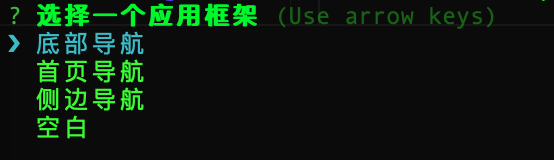

# vue-cli-plugin-apicloud
apicloud for vue-cli plugin

## 项目说明

* 默认是多页应用，所以未集成vue-router，如需要，请自行配置
* 默认提供一个html模板，即public/index.html。
* 支持不同页面不同html模板，只需要在public下复制index.html并改名为页面名称。比如pages/hello -> public/hello.html

## 使用

* 安装

    使用前提：使用vue-cli3 创建的项目

    ```js
    vue add apicloud
    ```

* 选择模板

    

* vue-cli-service扩展命令

    ```bash
    vue-cli-service ac <command> [options]
    ```

    * vue-cli-service ac add NewPage --type [default|blank]
        * default ：默认模板，也就是page+frame模式，
        * blank ：空白页


## Vue.prototype 扩展

### api

    替代window.api

### $api

    替代window.$api

### $page

* 方法

    * open

        * 参数
            * url: 打开页面路径，比如hello.html (可简写hello)
            * opts: 
            ```js
            {
                title: 'New Page'
            }
            ```
    * close
        
        关闭当前页面

## Vue 实例扩展

* onReady

    代替window.apiready

* onWindowChange

    支持设备屏幕旋转监听

* apiEvent

    支持apicloud的页面事件监听，比如keyback

    ```js
    export default {
        apiEvent: {
            keyback () {
                alert('按了返回键');
            }
        }
    }
    ```
    更多事件，请查看[文档](https://docs.apicloud.com/Client-API/api#c3)

## 注意

* 不支持tapmode

    由于tapmode需要元素定义onclick，这与vue相冲突。默认使用fastclick替代后解决
    